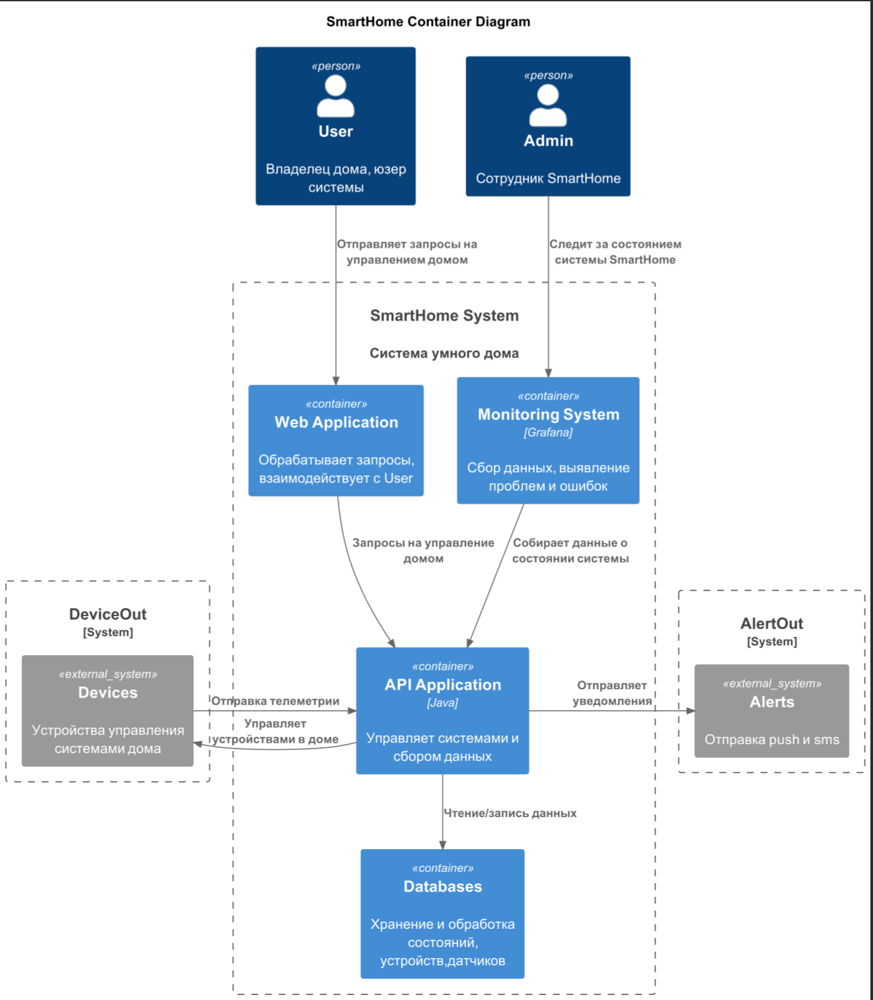
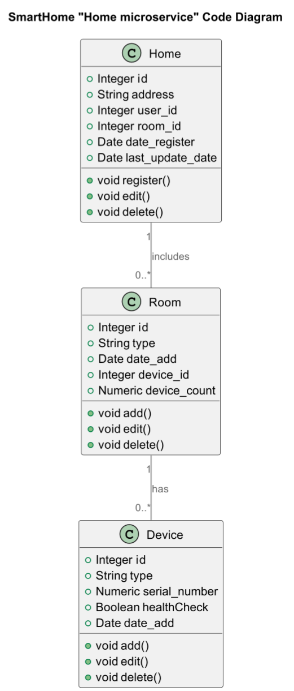

## Задание 1: Анализ и проектирование
### Подзадание 1.1: Анализ и планирование

1. Функциональность текущего монолитного приложения:

Пользователь может:
- получить текущую температуру всего дома
- установить требуемую одну температуру на весь дом
- может включить/выключить систему управления отоплением

Датчик добавляется установщиком вручную.
Невозможно управлять отоплением каждой комнаты отдельно.

2. Архитектура приложения:
- Язык программирования - Java:

Есть всё необходимое  для разработки приложения.
Богатая библиотека и масштабируемость.

- База данных - PostgreSQL:

Подходит для разработки приложения.
Гарантирует согласованность данных и поддерживает ACID-транзакции.

- Архитектура:

Монолит - дешевая, надежная и быстрая разработка.
Проблемы с изменяемостью, масштабированием и расширяемостью.

- Взаимодействие 

Ручное подключение датчиков и системы - через спец. работник удлинняют скорость подключения
и ограничивают рост пользователей физическими возможностями.

- Масштабируемость 

Ограничена. Приложение целиком

- Развертывание

Требуется остановка приложения.

3. Домены и границы контекстов в системе:

Сейчас есть:
Система управления отоплением

Можно сделать:
- Домен 1: Пользователь
- Домен 2: Дом
- Домен 3: Устройства
- Домен 4: Телеметрия

4. System Context diagram (PlantUML):

### Подзадание 1.2: Архитектура микросервисов

C4 — Уровень контейнеров (Containers)

C4 — Уровень компонентов (Components)

C4 — Уровень кода (Code)

### Подзадание 1.3: ER-диаграмма

Решение задачи в файле - diagrams/ER/er.puml 

### Подзадание 1.4: Создание и документирование API

**API для микросервиса «Управление устройствами»**

Device-api.yaml

**API для микросервиса «Телеметрия»**

Telemetry-api.yaml